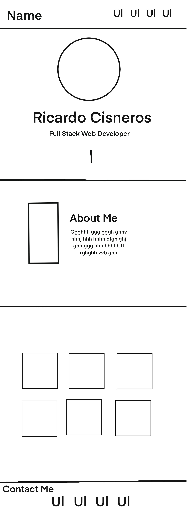

# My-Portfolio

## Description

I built this project to put into work the skills that the bootcamp has taught me so far. This bootcamp was built to continue to practice my skills and so that I can provide recruiters with some of my projects. This helps recruiters and companies look at a a series of projects that I have built. It shows comapnies some of the skills that I have. I learned many new properties and ways to set up my sections. Websites look very easy to the eye but it is a different story when you are the one developeing them.

## Usage

My Portfolio Mockup

<<<<<<< HEAD

    
=======
    
     
>>>>>>> c4af2551b2a7bf828083e0bb2c4df1574070ad37
    

## License
License in GitHub.

